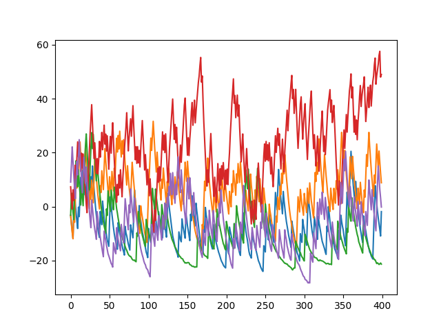
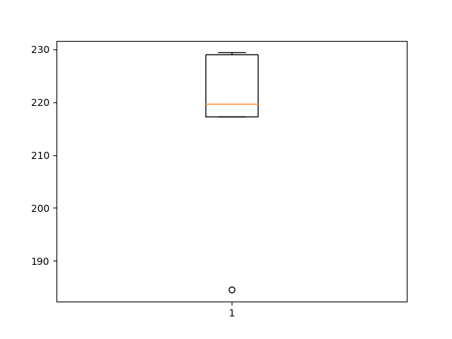

# 3η ΑΤΟΜΙΚΗ ΑΣΚΗΣΗ ΤΕΧΝΟΛΟΓΙΕΣ ΕΦΙΩΝ ΣΥΣΤΗΜΑΤΩΝ
## ΠΑΝΑΓΙΩΤΗΣ ΠΑΠΑΝΙΚΟΛΑΟΥ
## ΑΜ 1067431

# PPO

Δεν κατάφερα να κάνω το PPO να μάθει το περιβάλλον. 

Για τον κριτή χρησιμοποιήθηκε ένα δίκτυο με την κατάσταση ως είσοδο 
και την value function της κατάστασης ως επιθυμητή έξοδο και για τον
actor δίκτυο με την κατάσταση ως είσοδο και 2 τιμές ως έξοδο, οι οποίες 
χρησιμοποιούνται ως η μέση τιμή και διασπορά κανονικής κατανομής από την οποία 
επιλέγεται η δύναμη που θα ασκηθεί όταν το αμάξι βρίσκεται σε εκείνη τη κατάσταση.

Στην αρχή μάθαινε την τακτική να μην κουνιέται καθόλου 
για να αποφύγει την ποινή και πίστευα ότι έφταιγε μόνο το ότι 
δεν είχε δει αρκετά παραδείγματα που παίρνει την ανταμοιβή της σημαίας για να 
μπορέσει να την ψάξει. Δοκίμασα να του φορτώσω αρκετά τυχαία παραδείγματα πριν 
αρχίσει να δρα ώστε να έχει προηγούμενη γνώση καθώς και να κάνω reset το 
πρόγραμμα αν δεν έφτανε την σημαία αρκετά νωρίς ώστε να μάθει για τη σημαία 
προτού στερεωθεί η στρατηγική ακινησίας.

Αφού αυτά δεν απέδωσαν εφάρμοσα παράλειψη frame ώστε η δύναμη να αλλάζει μόνο κάθε 5 χρονικές στιγμές. Αυτό φαίνεται να διευκόλυνε το πρόβλημα σε σημείο που η 
τυχαία επιλογή κινήσεων να φτάνει τη σημαία περίπου το 30% των επεισοδίων. Ακόμα και τότε πήγαινε στη τακτική ακινησίας.

Έλεγξα ότι μπορεί να μάθει να σκαρφαλώνει αν δεν του δίνεται ποινή για τα actions. Επίσης δοκίμασα να μειώσω τη ποινή στο 5% της αρχικής. Πρώτα μάθαινε και τότε την ακινησία αλλά αφού μείωσα το learning rate στο 1e-4 κατάφερε μετά από κάποιο σημείο να σκαρφαλώνει στη πλειοψηφία των επεισοδίων. Ακόμα και όταν τα καταφέρνει όμως του παίρνει εκατοντάδες επεισόδια να φτάσει εκεί.

Η βελτίωση λόγω του μειωμένου ρυθμού μάθησης πιστέυω πως οφείλεται στο ότι όταν προσπαθούσε να μειώσει το κόστος του να φτάσει στο στόχο έκανε overcorrect προηγουμένως.

Υπέθεσα πως μειώνοντας το decay θα βελτιωνόταν η απόδοση, καθώς θα λάμβανε περρισσότερο υπόψη στην αρχή το βραβείο των 100 στο τέλος του επεισοδίου, αλλά δεν 
παρατήρησα να βοήθησε.

Άλλη αλλαγή που δεν κατέληξε να χρησιμεύσει ήταν να αλλάξω το πόσες φορές ανανεώνονται τα δίκτυα των actor και critic ανά κλήση τής update του αλγορίθμου.

Στην έξοδο του actor χρησιμοποιώ σιγμοειδή συνάρτηση. Από δοκιμές με Relu και tanh φάνηκε να είναι η μόνη που παρήγαγε έστω και λίγο λειτουργικά αποτελέσματα.

Αφού η απόδοση είναι αισθητά χειρότερη της τυχαίας κίνησης είτε κάτι στην υλοποίηση έχει γίνει λάθος με τέτοιο τρόπο που εμποδίζει την εκμάθηση είτε έχω καταλάβει κάποιο βασικό κομμάτι του πως λειτουργούν τα actor-critic / γενικά Q-learning λάθος.

Μετατροπές τις οποίες δεν έχω ελέγξει περιλαμβάνουν την κανονικοποίηση / κωδικοποίηση των εισόδων των δικτύων, καθώς και παραλαγές του περιβάλοντος π.χ. επιστρέφοντας επιβράβευση για το πόσο ψηλά πήγε το αμάξι.

# TD3

Ό TD3 δεν έχει υλοποιηθεί

# DIAGRAMS

- Expected Return



- Execution Times



# PPO IMPLEMENTATION 

```{.python}

!include ppo.py

```
